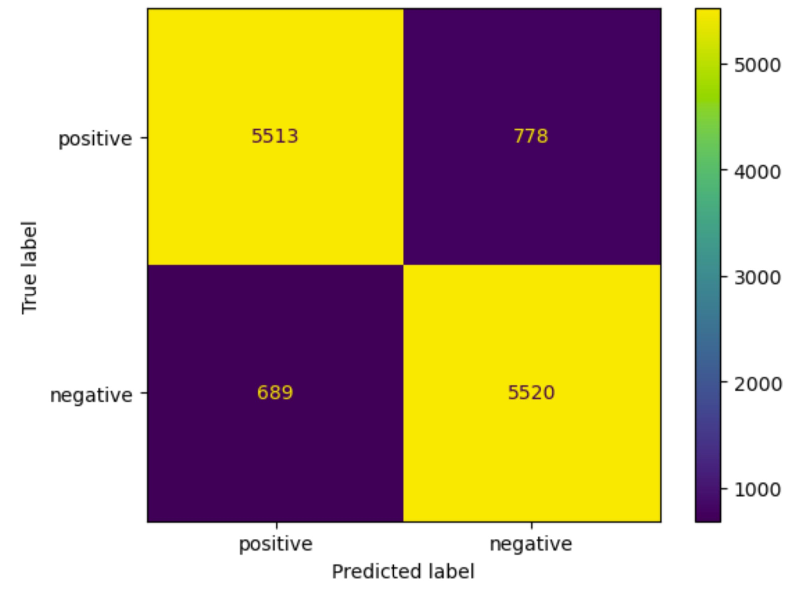

<a name="readme-top"></a>


# IMDB Sentiment Analysis


## Project Description
Imagine a company you work for sells widely-used products, and customers rightfully leave reviews based on their experience with those products. Now imagine your job is to classify each review, and determine the pros and cons of each product to improve upon it. But now you have a very mind-numbing task ahead of you: to manually scan through thousands of reviews. Doesn't sound too fun right? This is where Sentiment Analysis is effective.

Sentiment analysis is a natural language processing (NLP) technique used to determine the emotional tone or “sentiment” expressed in a piece of text. This can apply to a multitude of industries to analyze customer feedback, monitor brands, understand market trends, and overall allow businesses to extract valuable insights from vast amounts of textual data in a way that is much more efficient than humans parsing through millions of data. 

In this project, I created a Recurrent Neural Network (RNN) that takes in movie reviews from the popular platform IMDB and classifies the review as either “positive” or “negative” based on the sentiment analysis of the text. The reason why I used an RNN is because RNNs are designed to handle sequential data. Since words in sentences are related to one another and are not distinct entities, RNNS are capable of retaining information from previous time steps during the training process, making them suitable for capturing the relationships between words in a sentence. 

## Table of Contents
<!-- TABLE OF CONTENTS -->
<ol>
  <li>
    <a href="#data-preprocessing">Data Preprocessing</a>
    <ul>
      <li><a href="#cleaning-data">Cleaning data</a></li>
      <li><a href="#data-transformation">Data transformation</a></li>
      <li><a href="#encoding-the-output">Encoding the Output</a></li>
      <li><a href="#data-splitting">Data splitting</a></li>
    </ul>
  </li>
  <li>
    <a href="#building-the-model">Building the Model</a>
    <ul>
      <li><a href="#embedding-layer">Embedding layer</a></li>
      <li><a href="#bidirectional-lstm-layer">Bidirectional LSTM layer</a></li>
      <li><a href="#fully-connected-layer">Fully connected layer</a></li>
    </ul>
  </li>
  <li>
    <a href="#model-evaluation">Model Evaluation</a>
    <ul>
      <li><a href="#confusion-matrix">Confusion matrix</a></li>
    </ul>
  </li>
  <li><a href="#conclusion-and-future-directions">Conclusion and future directions</a></li>
  <li><a href="#contact">Contact</a></li>
  <li><a href="#acknowledgements">Acknowledgements</a></li>
</ol>


## Data Preprocessing

This project uses this Kaggle dataset of 50,000 movie reviews from IMDB. The dataset is a `.csv` file where the first column is the review text and the second column is whether it is "positive" or "negative.

Unfortunately, we cannot just use the raw dataset and feed it into our model. The data must be cleaned and transformed in a way suitable for analysis. 


### Cleaning Data

#### Pre-cleaned data
```
Probably my all-time favorite movie, a story of selflessness, sacrifice and dedication to a noble cause, but it's not preachy or boring. It just never gets old, despite my having seen it some 15 or more times in the last 25 years. Paul Lukas' performance brings tears to my eyes, and Bette Davis, in one of her very few truly sympathetic roles, is a delight. The kids are, as grandma says, more like "dressed-up midgets" than children, but that only makes them more fun to watch. And the mother's slow awakening to what's happening in the world and under her own roof is believable and startling. If I had a dozen thumbs, they'd all be "up" for this movie.
```

The first step is to "clean" the data and extract only the most important variables from the text. I performed these common text preprocessing steps:
<ul>
  <li>Removing punctuation</li>
  <li>Lowercase text</li>
  <li>Removing stop words
    <ul>
      <li> Stop words are the most common words in the English language such as “I”, “have”, “are”, etc. Alone, these words do not hold any significant meaning, and can thus skew our sentiment analysis. So, we remove all instances of these stop words.
      </li>
    </ul>
  </li>
  <li>Word stemming
    <ul>
      <li>Stemming reduces words to their root form by removing suffixes; so “walking” and “walked” becomes “walk”. This ensures that multiple versions of the same word are treated the same.
      </li>  
    </ul>
  </li>
</ul>
Additionally, this specific dataset has multiple instances of line breaks, which were removed as well. 

#### Stop words and stemming
```
stop_words = set(stopwords.words('english'))
stemmer = SnowballStemmer("english")
f_ = lambda x: ' '.join([stemmer.stem(word) for word in x.split() 
                             if word not in (sw)])
```
##### After removing stop words
```
probabl all-tim favorit movie, stori selflessness, sacrific dedic nobl cause, preachi boring. it never get old, despit seen 15 time last 25 years. paul luka perform bring tear eyes, bett davis, one truli sympathet roles, delight. the kid are, grandma says, like "dressed-up midgets" children, make fun watch. and mother slow awaken what happen world roof believ startling. if i dozen thumbs, they'd "up" movie.
```
#### clean_text function

```
def clean_text(data):
    # Make all words lowercase
    data = data.lower()
    
    # Remove line breaks
    data = data.replace("<br /><br />", "")
    
    # Remove distracting single quotes
    data = re.sub("\'", "", data)
    return data
```

#### Removing punctuation and repeating words
```
## Removes punctuation and repeating words
def sentence_to_words(sentences):
    for sentence in sentences:
        yield(gensim.utils.simple_preprocess(str(sentence), deacc=True))
```

##### Fully cleaned data
```
probabl all tim favorit movie stori selflessness sacrific dedic nobl cause preachi boring it never get old despit seen time last years paul luka perform bring tear eyes bett davis one truli sympathet roles delight the kid are grandma says like dressed up midgets children make fun watch and mother slow awaken what happen world roof believ startling if dozen thumbs theyd up movie
```
### Data Transformation

Now that we have cleaned the data, we must transform the raw text into a form that deep learning models can understand. We do this through “Tokenization”, which breaks down text into individual words or “tokens”. These tokens are then converted to sequences of integers.

```
max_words = 5000
max_len = 200

# Tokenizing (breaking down text into sequences of integers)
tokenizer = Tokenizer(num_words=max_words)
tokenizer.fit_on_texts(data)
sequences = tokenizer.texts_to_sequences(data)
reviews = pad_sequences(sequences, maxlen=max_len)
```

We do this using `Keras` tokenizer. In this particular instance of tokenization, `max_words = 5000` means that only the most frequent 5,000 words will be kept, and less frequent words are discarded. `max_len = 200` means that the maximum length of the sentences is 200 words. If a sentence is longer than 200, it will be truncated, and if it's shorter, it will be padded to reach the desired length.
#### After tokenizing

```
[[   0    0    0 ...  527 3612  424]
 [   0    0    0 ...  444   20  150]
 [   0    0    0 ...   30   12  992]
 ...
 [   0    0    0 ...  306  458 3493]
 [   0    0    0 ... 1859  358  539]
 [   0    0    0 ...  974  604   15]]
```

### Encoding the output

An important preprocessing step is label encoding the output, which means representing categorical output variables with numerical values. In this context, “positive” and “negative” sentiments will be represented as “1” and “0” respectively. 

```
le = LabelEncoder()
y = le.fit_transform(y)
```

We do this using the LabelEncoder class from `Scikit learn (Sklearn)`, which automatically separates each output to its respective numerical representation.

#### Before encoding
```
['positive' 'positive' 'positive' ... 'negative' 'negative' 'negative']
```
#### After encoding
```
[1 1 1 ... 0 0 0]
```


### Data splitting

Finally, now that the input data is fully preprocessed and the output is encoded, we can split the dataset into its training and testing subsets using the train_test_split class from `Sklearn`.

```
X_train, X_test, y_train, y_test = train_test_split(reviews, y, random_state=0)
```

## Building the Model

```
Model: "sequential_22"
_________________________________________________________________
 Layer (type)                Output Shape              Param #   
=================================================================
 embedding_23 (Embedding)    (None, 200, 40)           200000    
                                                                 
 bidirectional_22 (Bidirecti  (None, 40)               9760      
 onal)                                                           
                                                                 
 dense_22 (Dense)            (None, 1)                 41        
                                                                 
=================================================================
Total params: 209,801
Trainable params: 209,801
Non-trainable params: 0
_________________________________________________________________
```

This RNN model is relatively simple with only 3 layers; however, each layer is vital to the RNN and serves a specific purpose.  
<ol>
  <li>Embedding layer
    <ul>
        <li> In the embedding layer, we convert words into dense vectors that pack information in few dimensions. Word embeddings represent words in a continuous vector space, where similar words are located closer to each other, meaning that words with similar meanings will have similar vector representations, which helps the model understand the context and identify sentiment-related words more effectively. The max_words parameter represents the size of the vocabulary, and each word is represented as a vector of length 40 (embedding dimension). The input_length parameter sets the length of the input sequences to be fed into the model, which should be max_len.
        </li>
    </ul>
  </li>
  <li>Bidirectional LSTM Layer
    <ul>
      <li> An LSTM (long short-term memory) layers is used. In vanilla RNNs, gradients calculated through multiple time steps during back propogation and can either grow exponentially (exploding gradients) or diminish rapidly (vanishing gradients). This is bad, because these problems can hinder the model's long-term learning. Thus, LSTMs are favored, since their structure creates a "gradient highway" that allows gradients to mintain their value over multiple time steps without significant loss or gain, thus solving the vanishing/exploding gradient problem. We go one step further by creating a Bidirectional layer, which allows the LSTM layer to process the input sequence in both forward and backward directions. Thus, the layer can more effectively capture sequential relationships in both directions compared to a unidirectional LSTM layer.
      </li>
      <li> The Bidirectional LSTM layer has 20 units (or cells), meaning it has 20 memory cells to remember information over time. Dropout, a regularization technique, helps prevent overfitting by randomly and temporarily "deleting" a fraction of input units during training. The dropout parameter is set to 0.5, meaning a random 50% of the input units will be deleted during each propogation. 
      </li>
    </ul>
  </li>
  <li>Fully connected layer
    <ul>
      <li>The Dense layer is a fully connected layer, where each neuron is connected to every output from the previous layer. It has a single neuron because the task is binary classification, and a sigmoid activation function is used to produce an output between 0 and 1, representing the probability of the input belonging to the positive class (since the activation is "sigmoid").
      </li>  
    </ul>
  </li>
</ol>

```
model.fit(X_train, y_train, epochs=10, batch_size=128, validation_data=(X_test, y_test), callbacks=[early_stopping])
```
When fitting the model, I utilized a batch size of 128 for 10 Epochs. I also monitored the model's performance on a validation set during training. The model's performance on the validation data is used to monitor how well the model generalizes to new, unseen data. If the validation loss starts to increase or stops improving, I utilize “early stopping”, another regularizaiton technique, to stop the training early which further decreases overfitting.

```
Epoch 1/10
293/293 [==============================] - 89s 293ms/step - loss: 0.4275 - accuracy: 0.8072 - val_loss: 0.3053 - val_accuracy: 0.8763
Epoch 2/10
293/293 [==============================] - 89s 303ms/step - loss: 0.2745 - accuracy: 0.8911 - val_loss: 0.2905 - val_accuracy: 0.8826
Epoch 3/10
293/293 [==============================] - 106s 362ms/step - loss: 0.2437 - accuracy: 0.9067 - val_loss: 0.2977 - val_accuracy: 0.8808
Epoch 4/10
293/293 [==============================] - 64s 219ms/step - loss: 0.2254 - accuracy: 0.9118 - val_loss: 0.2976 - val_accuracy: 0.8791
```

## Model Evaluation

The model reached a final test accuracy of `0.8826`, which is slightly lower than the highest training accuracy of `0.9118`. Due to the early stopping, the model halted training after Epoch 4. 

### Confusion matrix
I computed and displayed the confusion matrix based on the predictions made by my model on the test dataset. The confusion matrix showed the model correctly classified 5513 positive reviews and 5520 negative reviews, yielding accuracies of `87.63%` and `88.90%` accuracy respectively. 

```
cm = confusion_matrix(y_test, y_pred)
print("Confusion Matrix:", cm)
```
```
display = ConfusionMatrixDisplay(confusion_matrix = cm, display_labels = ("positive", "negative"))
display.plot()
plt.show()
```



## Conclusion and future directions

In this project, a Recurrent Neural Network (RNN) was successfully developed for sentiment analysis on movie reviews from IMDB. The model demonstrated promising performance with a final test accuracy of   88.26%  . By leveraging the power of NLP and deep learning techniques, I was able to efficiently process and analyze large volumes of textual data, providing valuable insights into customer sentiments towards products.

With the model being incredibly simple, I hope to create a more complex RNN to achieve at least 95% test accuracy, as well as fine-tuning hyper parameters. Additionally, I am curious to see how effectively my model can categorize reviews into increasing categories, such as including a “neutral” output or even classifying reviews into their respective 1-5 star rating. 

## Contact

CC Ly - [LinkedIn](https://www.linkedin.com/in/vanessly/) - vanessly@umich.edu

## Acknowledgments

* Lucian Leahu, my professor for my Artifical Neural Networks course. Thank you for igniting my newfound interest in machine learning, and for being such an awesome instructor! 
* Nicolai Jacobsen, an assistant professor for my Artificial Neural Networks course. Thank you for helping me with CS career things, and helping me get out of my own head and not overthink!
